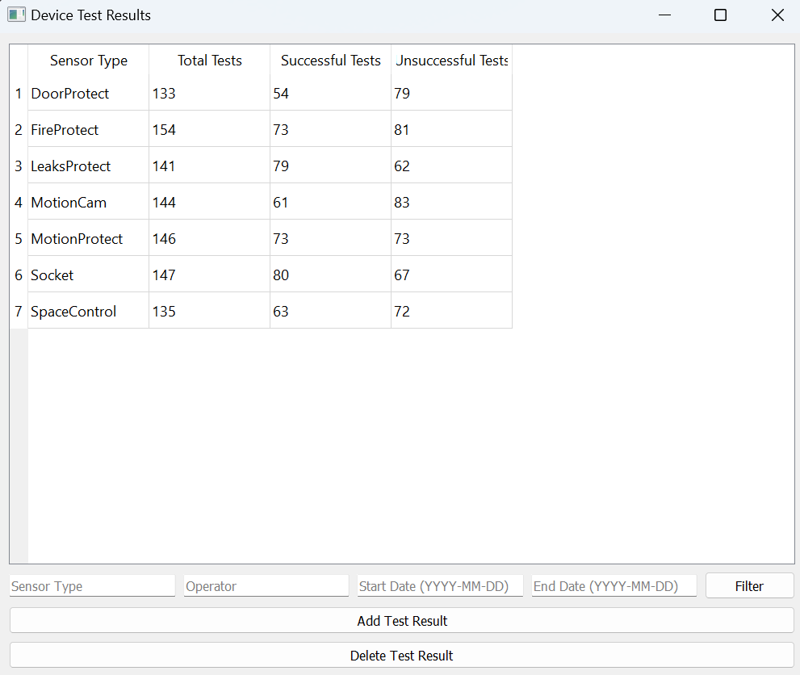
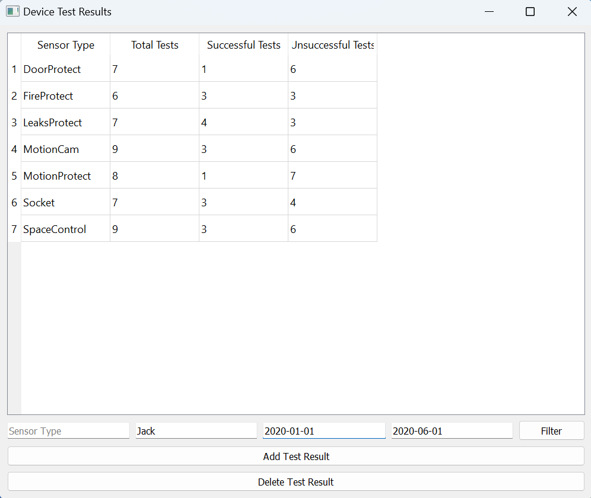
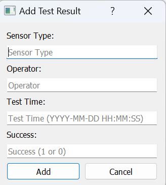
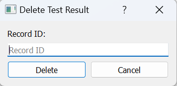

# levkivskyi-v-ajax-test-gui

## Description

This project implements an interface in PyQt5 that interacts with the API to view statistics, add and delete records from the database.

1. Install requirements.txt
   ```bash
   pip install -r requirements.txt
   
2. Run the program through the main_window.py file

## Program operation

#### Device Test Results




#### Add Test Result



#### Delete Test Result

